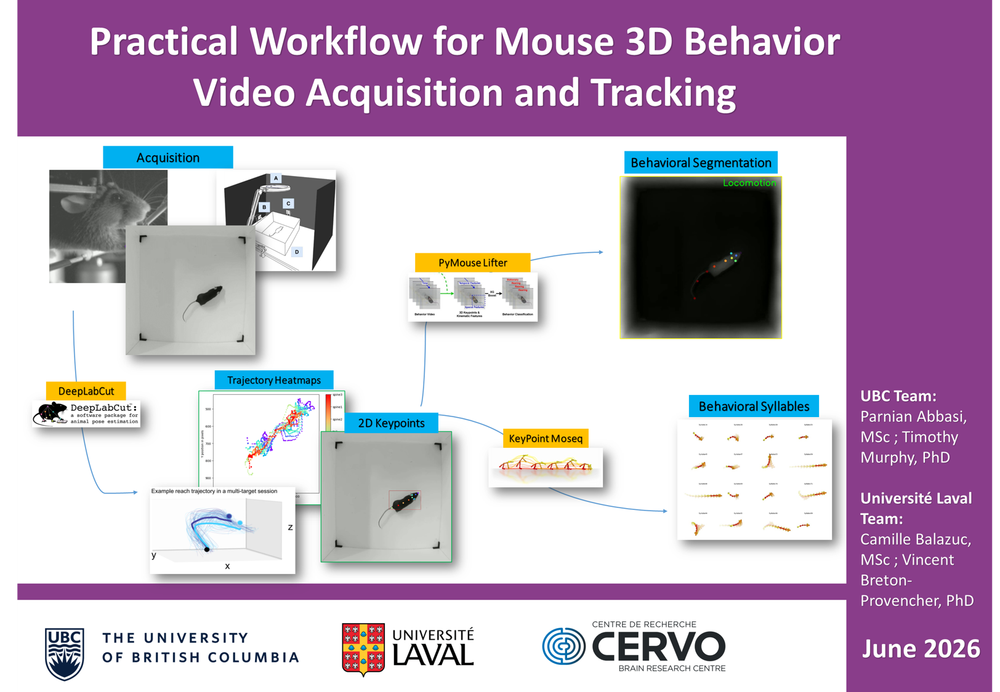

# Frontiers in Neurophotonics Summer School - June 2026 - 

# DeepLabCut GUI — Simple Install Guide

This is a clean student-friendly setup for **DeepLabCut with GUI**

Tested target versions:

* `deeplabcut==3.0.0rc6`
* `matplotlib==3.8.4`
* `numpy==1.26.4`
* `napari==0.4.18`
* `napari-deeplabcut==0.2.1.6`

Tested GPU stack:

* `torch==2.5.1`
* `torchvision==0.20.1`
* `torchaudio==2.5.1`
* `pytorch-cuda=12.1`

Useful links:
* Miniforge (installs Python and conda): [https://kirenz.github.io/codelabs/codelabs/miniforge-setup/#0](https://kirenz.github.io/codelabs/codelabs/miniforge-setup/#0)
* DeepLabCut Documentation and Installation: [https://deeplabcut.github.io/DeepLabCut/README.html](https://deeplabcut.github.io/DeepLabCut/README.html)
* DeepLabCut package: [https://pypi.org/project/deeplabcut/](https://pypi.org/project/deeplabcut/)
* Keypoint-MoSeq Dpcumentation and Installation: [https://keypoint-moseq.readthedocs.io/en/latest/](https://keypoint-moseq.readthedocs.io/en/latest/])
* PyMouse-Lifter Documentation and Installation: [https://github.com/Haozong-Zeng/PyMouse-Lifter](https://github.com/Haozong-Zeng/PyMouse-Lifter)
* PyTorch install page: [https://pytorch.org/get-started/locally/](https://pytorch.org/get-started/locally/)
* PyTorch previous versions: [https://pytorch.org/get-started/previous-versions/](https://pytorch.org/get-started/previous-versions/)

---

## Before you start

1. Install **Miniforge**.
2. Open **Miniforge Prompt**.
3. Do everything in a **new environment**.

Do **not** install DeepLabCut in `base`.

---

## Which version of DeepLabCut should you install?

### Use the GPU version if:

* you have an **NVIDIA GPU**
* or PyTorch GPU already works on your computer

### Use the CPU version if:

* you do **not** have an NVIDIA GPU
* or the GPU install fails
* or you just want the simplest fallback

---

## How to check if GPU already works on your computer

If you already have another PyTorch environment, activate it and run:

```bash
python -c "import torch; print(torch.__version__); print(torch.version.cuda); print(torch.cuda.is_available())"
```

Example:

```bash
2.5.1
12.1
True
```

This means:

* PyTorch version = `2.5.1`
* CUDA runtime used by PyTorch = `12.1`
* GPU is available = `True`

If you get something like this, the safest choice is usually to install the **same Torch/CUDA combination** in your DeepLabCut environment.

---

# Recommended DLC install: GPU version

```bash
mamba create -n DLC3 python=3.10.13 -y
```
If you encounter a "shell not initialized" error, run this:
```bash
mamba init
```
And then close the terminal and reopen by typing "Miniforge" in the search bar. Then run these commands, wait for each command to finish and then run the next line:
```bash
mamba activate DLC3
```
```bash
mamba install pytorch==2.5.1 torchvision==0.20.1 torchaudio==2.5.1 pytorch-cuda=12.1 -c pytorch -c nvidia -y
```
```bash
pip install --pre "deeplabcut[gui]==3.0.0rc6"
```
```bash
pip install matplotlib==3.8.4 numpy==1.26.4 napari==0.4.18 napari-deeplabcut==0.2.1.6
```

## Check that it worked

```bash
python -c "import torch, deeplabcut, napari, napari_deeplabcut; print('torch', torch.__version__); print('cuda', torch.version.cuda); print('gpu?', torch.cuda.is_available()); print('dlc', deeplabcut.__version__); print('napari', napari.__version__)"
```

## Launch the GUI

```bash
python -m deeplabcut
```

---

# Fallback DLC install: CPU version

Use this only if the GPU version does not work.

```bash
conda create -n DLC3_cpu python=3.10.13 -y
```
If you encounter a "shell not initialized" error, run this:
```bash
mamba init
```
And then close the terminal and reopen by typing "Miniforge" in the search bar. Then run these commands, wait for each command to finish and then run the next line:
```bash
conda activate DLC3_cpu
```
```bash
conda install pytorch==2.5.1 torchvision==0.20.1 torchaudio==2.5.1 cpuonly -c pytorch -y
```
```bash
pip install --pre "deeplabcut[gui]==3.0.0rc6"
```
```bash
pip install matplotlib==3.8.4 numpy==1.26.4 napari==0.4.18 napari-deeplabcut==0.2.1.6
```

## Check that it worked

```bash
python -c "import torch, deeplabcut; print('torch', torch.__version__); print('gpu?', torch.cuda.is_available()); print('dlc', deeplabcut.__version__)"
```

For CPU install, `gpu?` should be `False`.

## Launch the GUI

```bash
python -m deeplabcut
```

---

## If you are not sure what CUDA/Torch to install

### Best case

If you already have a working PyTorch environment, run:

```bash
python -c "import torch; print(torch.__version__); print(torch.version.cuda); print(torch.cuda.is_available())"
```


Then copy that same Torch/CUDA setup into the new DeepLabCut environment.

### If they do not already have a working PyTorch setup

Use the official PyTorch install page and choose:

* OS: your computer's OS
* Package: **Conda**
* Language: **Python**
* Compute Platform: the recommended CUDA version for your machine

If you are unsure, use the **CPU version** above.

---

## Troubleshooting

```bash
python -c "import torch; print(torch.__version__); print(torch.version.cuda); print(torch.cuda.is_available())"
python -c "import deeplabcut; print(deeplabcut.__version__)"
python -c "import napari; print(napari.__version__)"
python -c "import napari_deeplabcut; print(napari_deeplabcut.__version__)"
```

---

## Clean reinstall

If the environment gets messy, delete it and start over:

```bash
conda deactivate
conda env remove -n DLC3 -y
```

or, for the CPU version:

```bash
conda deactivate
conda env remove -n DLC3_cpu -y
```

---

## Very short version

### GPU

```bash
conda create -n DLC3 python=3.10.13 -y
conda activate DLC3
conda install pytorch==2.5.1 torchvision==0.20.1 torchaudio==2.5.1 pytorch-cuda=12.1 -c pytorch -c nvidia -y
pip install --pre "deeplabcut[gui]==3.0.0rc6"
pip install matplotlib==3.8.4 numpy==1.26.4 napari==0.4.18 napari-deeplabcut==0.2.1.6
python -m deeplabcut
```

### CPU

```bash
conda create -n DLC3_cpu python=3.10.13 -y
conda activate DLC3_cpu
conda install pytorch==2.5.1 torchvision==0.20.1 torchaudio==2.5.1 cpuonly -c pytorch -y
pip install --pre "deeplabcut[gui]==3.0.0rc6"
pip install matplotlib==3.8.4 numpy==1.26.4 napari==0.4.18 napari-deeplabcut==0.2.1.6
python -m deeplabcut
```

# PyMouse Lifter offline demo setup

This guide describes how to set up the PyMouse Lifter offline inference workflow, place the required model files, run inference on extracted video frames, and visualize the results.

The recommended workflow is:

1. Clone the repository.
2. Fix the `tourchhub` folder typo if the repository still contains it.
3. Create the `pymouse_infer` conda environment from the YAML file.
4. Install the PyTorch build that matches the computer's GPU/CUDA support.
5. Download the required model files and place them in the expected folders.
6. Convert the video to frames.
7. Run `run_PyMouseLifter_offline_demo.py` on the frame folder.
8. Open `VisualizeOfflineDemo.ipynb` to inspect the output.

---

## 1. Clone the repository

```bash
git clone https://github.com/Haozong-Zeng/PyMouse-Lifter.git
```

```bash
cd PyMouse-Lifter/Depth-Anything
```

If the repository contains a misspelled folder named `tourchhub`, rename it to `torchhub`:

```bash
# Windows Command Prompt
ren tourchhub torchhub

# macOS/Linux/Git Bash
mv tourchhub torchhub
```

---

## 2. Expected folder structure

After downloading the model files, the repository should look like this:

```text
PyMouse-Lifter/
├── Depth-Anything/
│   ├── run_PyMouseLifter_offline_demo.py
│   ├── VisualizeOfflineDemo.ipynb
│   ├── metric_depth/
│   │   └── checkpoints/
│   │       └── depth_anything_metric_PyMouse_HQ_orbbec_trans_synthetic.pt
│   └── other_models/
│       ├── yolo11m-orbbec-pose-real.pt
│       └── rf_model_realtime_demo.pkl
├── frames1/
│   ├── frame_000001.png
│   ├── frame_000002.png
│   └── ...
└── pymouse_infer.yml
```

The default offline script assumes it is run from inside `PyMouse-Lifter/Depth-Anything/`.

---

## 3. Create the conda environment

Use the cleaned `pymouse_infer.yml` file in this repository. Do not include a machine-specific `prefix:` line in a shared YAML file.

```bash
conda env create -f pymouse_infer.yml
```

```bash
conda activate pymouse_infer
```

Important: use `conda env create -f pymouse_infer.yml`, not `conda create env -f pymouse_infer.yml`.

---

## 4. Install PyTorch separately

PyTorch is installed separately because the correct wheel depends on the computer's GPU, driver, operating system, and desired CUDA runtime.

### Option A: known tested setup on this machine

This was tested with PyTorch 2.5.1 and CUDA 12.1:

```bash
python -m pip install torch==2.5.1 torchvision==0.20.1 torchaudio==2.5.1 --index-url https://download.pytorch.org/whl/cu121
```

Expected check:

```bash
python -c "import torch; print(torch.__version__); print(torch.version.cuda); print(torch.cuda.is_available()); print(torch.cuda.get_device_name(0) if torch.cuda.is_available() else 'CPU only')"
```

Expected output on a working CUDA 12.1 GPU install is similar to:

```text
2.5.1+cu121
12.1
True
<your GPU name>
```

### Option B: different GPU / different CUDA build

Use the official PyTorch install selector or previous-version page to choose the correct command for that computer.

For PyTorch 2.5.1, common pip options are:

```bash
# CUDA 11.8
python -m pip install torch==2.5.1 torchvision==0.20.1 torchaudio==2.5.1 --index-url https://download.pytorch.org/whl/cu118

# CUDA 12.1
python -m pip install torch==2.5.1 torchvision==0.20.1 torchaudio==2.5.1 --index-url https://download.pytorch.org/whl/cu121

# CUDA 12.4
python -m pip install torch==2.5.1 torchvision==0.20.1 torchaudio==2.5.1 --index-url https://download.pytorch.org/whl/cu124

# CPU only
python -m pip install torch==2.5.1 torchvision==0.20.1 torchaudio==2.5.1 --index-url https://download.pytorch.org/whl/cpu
```

Notes:

- `torch.version.cuda` reports the CUDA runtime used by the installed PyTorch wheel.
- `torch.cuda.is_available()` must be `True` if you want GPU inference.
- If it is `False`, check the NVIDIA driver with `nvidia-smi`, then reinstall the correct PyTorch wheel.
- The full CUDA Toolkit is usually not needed just to run PyTorch wheels, but a compatible NVIDIA driver is needed.

---

## 5. Install remaining Python packages, if needed

The cleaned YAML already includes these, but if an existing environment is missing them, install with:

```bash
python -m pip install joblib scikit-learn tqdm opencv-python matplotlib open3d ultralytics
```

Use `python -m pip` instead of plain `pip` to make sure packages are installed into the currently activated Python environment.

---

## 6. Download and place model files

Download the Depth-Anything PyMouse checkpoint from:

file: depth_anything_metric_PyMouse_HQ_orbbec_trans_synthetic.pt
```text
https://ucsandiego2.app.box.com/s/vr6tagor9fqahjh91xu1qs6h5ujqm39b
```

Place this file here:

```text
PyMouse-Lifter/Depth-Anything/metric_depth/checkpoints/
```

Download the YOLO pose model from:
file: yolo11m-orbbec-pose-real.pt
```text
https://ucsandiego2.app.box.com/s/2cvosqdjs7zybwqsja9exjq2itfbmer1
```
And the random-forest classifier from:
file: rf_model_realtime_demo.pkl
```text
https://ucsandiego2.app.box.com/s/ij1fux4wvi9q014b016r1yj8fahtkdfe
```

Place them here:

```text
PyMouse-Lifter/Depth-Anything/other_models/
```

```text
PyMouse-Lifter/Depth-Anything/other_models/
```

---

## 7. Convert video to frames

Use the ```text export_frames.ipynb``` notebook to extract frames into a folder, for example:

```text
PyMouse-Lifter/frames1/
```

Make sure the frames are sorted correctly by filename, for example:

```text
frame_000001.png
frame_000002.png
frame_000003.png
...
```

Avoid names like `frame_1.png`, `frame_10.png`, `frame_2.png`, because alphabetical sorting can put them in the wrong order. Use zero-padding.

---

## 8. Run offline inference

If you're not already inside the `Depth-Anything` folder:

```bash
cd PyMouse-Lifter/Depth-Anything
```
```bash
conda activate pymouse_infer
```
```bash
python run_PyMouseLifter_offline_demo.py --img_path ../frames1 --outdir ./output_frames1 --batch_size 2 --save_depth_vis
```

On Windows Command Prompt, the same command can be written as:

```cmd
cd PyMouse-Lifter\Depth-Anything
```
```cmd
conda activate pymouse_infer
```
```cmd
python run_PyMouseLifter_offline_demo.py --img_path ..\frames1 --outdir .\output_frames1 --batch_size 2 --save_depth_vis
```

If you do not need the depth visualization video, omit `--save_depth_vis`:

```bash
python run_PyMouseLifter_offline_demo.py --img_path ../frames1 --outdir ./output_frames1 --batch_size 2
```

---

## 9. Expected outputs and Visualization of the Results

The output folder should contain:

```text
output_frames1/
├── raw_video.mp4
├── behavior_classification.txt
└── depth_vis.mp4      # only if --save_depth_vis was used
```

Then open:

```text
PyMouse-Lifter/Depth-Anything/VisualizeOfflineDemo.ipynb
```

and point it to the output folder, for example:

```python
output_dir = "./output_frames1"
```

---

## 10. Online classification

Download this from current repository:
```text
online_classification_pymouselifter_v.py
```

Place it here:
```text
PyMouse-Lifter/Depth-Anything/
```

Activate the environment:
```bash
conda activate pymouse_infer
```

Change the directory:
```bash
cd PyMouse-Lifter/Depth-Anything/
```

Run online classification:
```bash
python online_classification_pymouselifter_v.py
```

You can change the depth model encoder with:

ViT-Small model:
```bash
python online_classification_pymouselifter_v.py --encoder vits
```

ViT-Base model:
```bash
python online_classification_pymouselifter_v.py --encoder vitb
```

ViT-Large model:
```bash
python online_classification_pymouselifter_v.py --encoder vitl
```

## 11. Common problems

### `torch.cuda.is_available()` is `False`

You likely installed a CPU-only PyTorch build, installed a CUDA build incompatible with the driver, or are using a computer without an NVIDIA GPU.

Check:

```bash
nvidia-smi
python -c "import torch; print(torch.__version__); print(torch.version.cuda); print(torch.cuda.is_available())"
```

Then reinstall PyTorch using the correct command from the official PyTorch selector.

### `ModuleNotFoundError: No module named 'depth_anything'`

Run the script from inside the `Depth-Anything` folder:

```bash
cd PyMouse-Lifter/Depth-Anything
python run_PyMouseLifter_offline_demo.py --img_path ../frames1 --outdir ./output_frames1
```

### Model file not found

Check that the files are exactly here:

```text
Depth-Anything/metric_depth/checkpoints/depth_anything_metric_PyMouse_HQ_orbbec_trans_synthetic.pt
Depth-Anything/other_models/yolo11m-orbbec-pose-real.pt
Depth-Anything/other_models/rf_model_realtime_demo.pkl
```

### Random-forest `.pkl` warning from scikit-learn

If `joblib.load()` gives a scikit-learn version warning, the model may still run, but the safest option is to install the same scikit-learn version used when the classifier was trained. If predictions fail, ask the model provider which scikit-learn version was used.

---

## 12. Suggested `.gitignore`

Do not commit large model files, extracted frames, videos, or output folders:

```gitignore
# model files
*.pt
*.pth
*.pkl

# extracted frames / videos / outputs
frames*/
output_frames*/
demo/
*.mp4
*.avi

# notebooks
.ipynb_checkpoints/

# Python cache
__pycache__/
*.pyc
```

